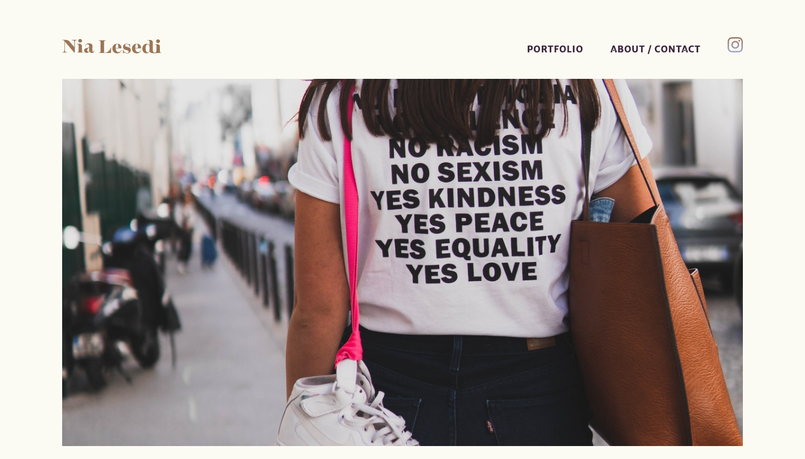
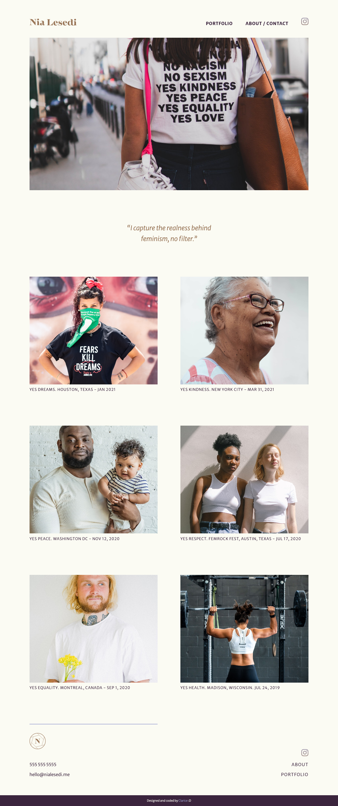

# Nia Lesedi - Feminist photographer page



## Welcome! 👋

Thanks for checking out my project.

## Table of contents

- [Overview](#overview)
  - [The challenge](#the-challenge)
  - [Links](#links)
- [My process](#my-process)
  - [Built with](#built-with)
  - [What I learned](#what-i-learned)
  - [Continued development](#continued-development)
  - [Useful resources](#useful-resources)
- [Author](#author)
- [Acknowledgments](#acknowledgments)
- [Screenshot](#screenshot)

## Overview

### The challenge

The challenge was to build out this photographer's portfolio page from scratch.

It started with "interviewing" the ficticious client. Her goals for the website are:

- It should showcase her work and entice magazines to purchase her photos for publication.
- It should help her show her work more widely in galleries, locally and abroad.

The requirements for the site are:

- Maximum 2 pages, as she wants to keep it simple and straight forward
- Her artist's statement
- A quote about her mission
- Logo
- Examples of her photography work
- Contact Information
- Instagram link

Her users should be able to:

- View the optimal layout for the site depending on their device's screen size
- See hover states for all interactive elements on the page

### Links

- Live Site URL: [Add live site URL here](https://your-live-site-url.com)

## My process

### Built with

- Semantic HTML5 markup
- Sass
- Flexbox
- CSS Grid
- Mobile-first workflow
- Vanilla JS

The project consisted in the following phases:

- Logo creation (name and icon/monogram);
- Sketching and laying out the site on paper first, and then into a wireframe;
- Designing an original web design comp;
- Coding the website using HTML, CSS and JS
- Publishing the website on GitHub Pages

My first step was to find inspiration by looking at websites that presents the content beautifully and are easy to navigate.

Then I developed the site structure, layout and navigation.

The next step was to build the wireframe in Adobe XD from the paper wireframe first created.

I followed with creating a color scheme and a style tile. The color scheme consist of three colors. The typography uses one typeface with different weights, and style to safely create interesting variation.

### What I learned

Starting a project from a blank page can be overwhealming. I learned that by following specific step by step planning makes it not only possible, but actually enjoyable.

I learned that the design goes a long way from the first draft, and consistent analisis and reiteration prevents us from runnign in circles when creating something that uttimatly has a function and need to solve a specific problem.

When coding the website I learned that creating containers and wrappers helps to keep everything together, and it's very satisfying having your CSS behaving the way it should <3 The more I practice building things, the less fiddling and struggling I find them :)

I am really proud of the hamburger menu animation I came up with. Of course it can be improved by not having the values hardcoded, and having to recalculate if I decide to change the size of the lines, but never the less, it works and it's very simple.

```css
.menu-toggle {
    > span:first-child {
      transform: translateY(8px) rotate(45deg);
    }
    > span:nth-child(2) {
      opacity: 0;
    }
    > span:last-child {
      transform: translateY(-8px) rotate(-45deg);
    }
```

I'm also proud of how I managed to make the ovelay mobile menu line up perfectly with the image underneath. If you happen to see it messed up, please let me know so I can investigate!

### Continued development

Although my JS code works, I can see that there is a lot of room for improvement. I plan to refactor the code to use toggle when possible, for example.

I managed to make the fade-in and out transitions for the overlay mobile menu work, but I feel that I don't fully understand it.

Also, I would like to implement a proper image gallery, for when the user click on one of the images, they can see it bigger, with options to close the view and also to go to the next and previous images.

Other improvement I can make is to create a contact form. The majority of photographer's sites I checked didn't have one, so it would be a nice way to go one step ahead and make things easier for the person trying to contact them.

### Useful resources

- [Coder Coder](https://www.youtube.com/channel/UCzNf0liwUzMN6_pixbQlMhQ) - Jessica's videos are so helpful in showing how to approach challenges we encounter and how to come up with solutions ourselves.
- [Site Inspire](https://www.siteinspire.com/) - I really like this website when looking for design inspiration for websites.

## Author

- Website - [Clarice](https://github.com/ClariceR)

## Acknowledgments

If you look closely, there is a subtle gradient animation on the instagram icon. I got the code to do that (and edited) from [NickNoordijk](https://codepen.io/NickNoordijk/pen/VLvxLE). Thanks Nick for sharing this on code pen!

The design prompt for this challenge was further developed from the Web Design course from [Skillcrush](https://skillcrush.com/). It's a great course and I highly recomend it.

### Screenshot


